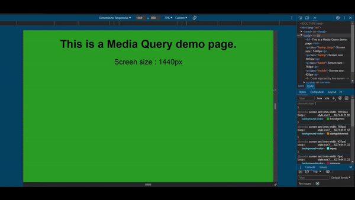

# Media Query Assignment

## Objective
The objective of this assignment is to create a responsive website using media queries. The website should have 4 breakpoints. The website should be responsive and should look good on all devices.

## Breakpoints
+ 425px: Mobile
+ 768px: Tablet
+ 1024px: Laptop
+ 1440px: Desktop

## Live Demo
[Media Query Assignment](https://divyam-kumar-pandey.github.io/Media-Query-Assignment/)
